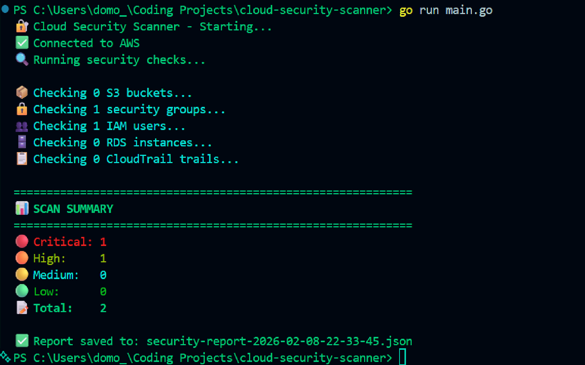

# 🔐 Cloud Security Scanner

**Enterprise-grade AWS security auditing tool written in Go.** Automatically scans your AWS infrastructure for security misconfigurations, generates detailed reports, and provides actionable remediation guidance.


## 📸 Demo



## 🎯 What It Does

Enterprise-grade security scanning across **5 AWS services** with **14 security checks**, **compliance framework mapping**, and **cost/risk analysis**:

### 📦 S3 Security (3 checks)
- ✅ Public access block configuration
- ✅ Default encryption at rest
- ✅ Bucket permissions validation

### 🔒 EC2 Security Groups (1 check)
- ✅ Internet-facing rules (0.0.0.0/0)
- ✅ Critical port exposure (SSH/RDP)

### 👥 IAM User Security (2 checks)
- ✅ Multi-factor authentication (MFA) enforcement
- ✅ Access key rotation (90-day policy)

### 🗄️ RDS Database Security (4 checks)
- ✅ Public accessibility
- ✅ Encryption at rest
- ✅ Backup retention policies
- ✅ Multi-AZ high availability

### 📋 CloudTrail Audit Logging (4 checks)
- ✅ Trail existence
- ✅ Active logging status
- ✅ Multi-region coverage
- ✅ Log file validation

### 💰 Cost & Risk Analysis
- ✅ Monthly AWS resource costs
- ✅ Financial risk exposure calculation
- ✅ Potential savings from remediation
- ✅ Business impact assessment

### 📋 Compliance Framework Mapping
- ✅ CIS AWS Foundations Benchmark
- ✅ PCI-DSS requirements
- ✅ SOC 2 controls
- ✅ HIPAA regulations
- ✅ NIST 800-53 standards

## 🚀 Quick Start

### Prerequisites

- Go 1.21 or higher
- AWS account with appropriate permissions
- AWS credentials configured

### Installation
```bash
# Clone the repository
git clone https://github.com/Griff-Reaper/cloud-security-scanner.git
cd cloud-security-scanner

# Install dependencies
go mod download

# Configure AWS credentials
cp .env.example .env
# Edit .env with your AWS access key and secret key

# Run the scanner
go run main.go
```

### First Scan
```bash
$ go run main.go

🔐 Cloud Security Scanner - Starting...
✅ Connected to AWS
🔍 Running security checks...

📦 Checking 0 S3 buckets...
🔒 Checking 1 security groups...
👥 Checking 1 IAM users...
🗄️  Checking 0 RDS instances...
📋 Checking 0 CloudTrail trails...

============================================================
📊 SCAN SUMMARY
============================================================
🔴 Critical: 1
🟠 High:     1
🟡 Medium:   0
🟢 Low:      0
📝 Total:    2

✅ Report saved to: security-report-2026-02-08-21-38-47.json
```

## 🔧 AWS Permissions Required

The scanner requires read-only access. Create an IAM user with these policies:

**AWS Managed Policies:**
- `SecurityAudit`
- `ViewOnlyAccess`

**Custom Policy (Minimal Permissions):**
```json
{
  "Version": "2012-10-17",
  "Statement": [
    {
      "Effect": "Allow",
      "Action": [
        "s3:GetBucketPublicAccessBlock",
        "s3:GetBucketEncryption",
        "s3:ListAllMyBuckets",
        "ec2:DescribeSecurityGroups",
        "iam:ListUsers",
        "iam:ListMFADevices",
        "iam:ListAccessKeys",
        "rds:DescribeDBInstances",
        "cloudtrail:DescribeTrails",
        "cloudtrail:GetTrailStatus"
      ],
      "Resource": "*"
    }
  ]
}
```

## 📁 Project Structure
```
cloud-security-scanner/
├── main.go                    # Main application and checks
├── screenshot.png             # Demo output
├── .env                       # AWS credentials (not committed)
├── .env.example              # Example configuration
├── .gitignore                # Git ignore rules
├── go.mod                    # Go dependencies
├── go.sum                    # Dependency checksums
├── LICENSE                   # MIT License
└── README.md                 # This file
```

## 🛡️ Security Checks Explained

### S3 Bucket Security

**Public Access Block (HIGH)**
```
Finding: S3 bucket lacks public access block
Risk: Accidental data exposure to the internet
Impact: Data breach, compliance violations
Remediation: Enable all four public access block settings
```

**Encryption at Rest (MEDIUM)**
```
Finding: S3 bucket without default encryption
Risk: Unencrypted data storage
Impact: Compliance violations, data exposure if bucket compromised
Remediation: Enable SSE-S3 or SSE-KMS encryption
```

### Security Group Analysis

**Open to Internet (CRITICAL/MEDIUM)**
```
Finding: Security group allows 0.0.0.0/0 access
Risk: Anyone on internet can attempt connections
Impact: Unauthorized access, brute force attacks, data exfiltration
Severity: CRITICAL for SSH/RDP, MEDIUM for other ports
Remediation: Restrict to specific IP ranges or use VPN/bastion
```

### IAM User Security

**MFA Not Enabled (HIGH)**
```
Finding: IAM user without multi-factor authentication
Risk: Password compromise = full account access
Impact: Account takeover, privilege escalation
Remediation: Enable virtual MFA device (Google Authenticator, Authy)
```

**Old Access Keys (MEDIUM)**
```
Finding: Access keys older than 90 days
Risk: Increased window for key compromise
Impact: Unauthorized API access if keys leaked
Remediation: Rotate keys every 90 days
```

### RDS Database Security

**Public Accessibility (CRITICAL)**
```
Finding: RDS instance accessible from internet
Risk: Direct database access from anywhere
Impact: Data breach, ransomware, compliance violations
Remediation: Disable public accessibility, use VPN or bastion
```

**Encryption at Rest (HIGH)**
```
Finding: RDS instance without encryption
Risk: Unencrypted database storage
Impact: Data exposure if storage compromised, compliance violations
Remediation: Create encrypted snapshot and restore (cannot enable on existing)
```

**Backup Retention (MEDIUM)**
```
Finding: Backup retention < 7 days
Risk: Limited disaster recovery capability
Impact: Data loss if incident occurs outside retention window
Remediation: Set retention to 7+ days
```

**Multi-AZ (MEDIUM)**
```
Finding: Single availability zone deployment
Risk: Downtime during AZ failures or maintenance
Impact: Application unavailability, potential data loss
Remediation: Enable Multi-AZ for automatic failover
```

### CloudTrail Logging

**Trail Not Enabled (CRITICAL)**
```
Finding: No CloudTrail trails configured
Risk: Zero audit logging of API activity
Impact: Cannot detect breaches, compliance violations, forensics impossible
Remediation: Create trail with multi-region logging
```

**Trail Not Logging (HIGH)**
```
Finding: Trail exists but not actively logging
Risk: Audit gap in security monitoring
Impact: Blind spot for security incidents
Remediation: Start logging in CloudTrail console
```

## 📊 Output Format

### Terminal Summary
- Color-coded severity levels
- Service-by-service progress
- Aggregated statistics
- Report filename

### JSON Report Structure
```json
{
  "scan_time": "2026-02-08T21:38:47Z",
  "region": "us-east-1",
  "findings": [
    {
      "check_name": "CloudTrail Not Enabled",
      "severity": "CRITICAL",
      "resource": "Account",
      "description": "No CloudTrail trails configured",
      "remediation": "Enable CloudTrail: AWS Console → CloudTrail → Create trail...",
      "timestamp": "2026-02-08T21:38:47Z"
    }
  ],
  "summary": {
    "critical": 1,
    "high": 1,
    "medium": 0,
    "low": 0,
    "total": 2
  }
}
```

## 🎨 Features

- ✅ **14 Security Checks** across 5 AWS services
- ✅ **Compliance Mapping** - CIS, PCI-DSS, SOC2, HIPAA, NIST
- ✅ **Cost Analysis** - Monthly costs + risk exposure
- ✅ **ROI Calculation** - Potential annual savings
- ✅ **Actionable Remediation** - Step-by-step fix instructions
- ✅ **Severity Classification** - Critical, High, Medium, Low
- ✅ **Multiple Output Formats** - JSON, HTML, text
- ✅ **CLI Flags** - Filter, format, region selection
- ✅ **Color-Coded Terminal** - Easy-to-read results
- ✅ **Production Ready** - Error handling, logging, validation

## 🔮 Roadmap

**Phase 2 - Enhanced Scanning:**
- [ ] AWS Lambda function security
- [ ] EBS volume encryption
- [ ] VPC flow logs validation
- [ ] KMS key rotation policies
- [ ] SNS/SQS encryption
- [ ] ELB security policies
- [ ] Route53 DNSSEC

**Phase 3 - Advanced Features:**
- [ ] CLI flags (--severity, --output, --region)
- [ ] HTML report generation
- [ ] Multi-region scanning
- [ ] Scheduled scans
- [ ] Slack/email notifications
- [ ] Compliance framework mapping (CIS, NIST, PCI-DSS)
- [ ] Drift detection (compare scans over time)

**Phase 4 - Enterprise Features:**
- [ ] Multi-account scanning (AWS Organizations)
- [ ] Azure support
- [ ] GCP support
- [ ] REST API
- [ ] Web dashboard
- [ ] Historical trending
- [ ] Custom policy engine

## 💼 Use Cases

**Security Teams:**
- Continuous compliance monitoring
- Security posture assessment
- Pre-audit preparation
- Remediation tracking

**DevOps Teams:**
- Infrastructure security validation
- CI/CD security gates
- Post-deployment verification
- Terraform/CloudFormation validation

**Compliance Teams:**
- CIS Benchmark validation
- PCI-DSS requirements
- SOC 2 controls
- HIPAA compliance

**Individual Developers:**
- Personal AWS account security
- Learning cloud security best practices
- Portfolio projects
- Certification preparation

## 📚 Learn More

- [AWS Security Best Practices](https://aws.amazon.com/security/best-practices/)
- [CIS AWS Foundations Benchmark](https://www.cisecurity.org/benchmark/amazon_web_services)
- [NIST Cybersecurity Framework](https://www.nist.gov/cyberframework)
- [Go AWS SDK v2 Documentation](https://aws.github.io/aws-sdk-go-v2/)

## 🤝 Contributing

This is a portfolio project, but contributions are welcome! Feel free to:
- Report bugs
- Suggest new security checks
- Submit pull requests
- Share feedback

## 📝 License

MIT License - See [LICENSE](LICENSE) file for details

## 👤 Author

**Jace** - System Administrator & AI Security Engineer

- 🔐 Active Secret Clearance
- 🛡️ CrowdStrike Falcon Administrator
- 🤖 AI-102 Certified (Microsoft Azure AI Engineer)
- 🎓 BS Computer Science (AI concentration) - In Progress

**Portfolio:** [GitHub Projects](https://github.com/Griff-Reaper)

## 🎯 Why This Project?

Built to demonstrate:
- **Go Programming** - Production-quality Go application
- **AWS Expertise** - Deep understanding of AWS security
- **Cloud Security** - Practical CSPM implementation
- **Security Automation** - Real-world security tooling
- **Enterprise Mindset** - Scalable, maintainable architecture

Perfect for roles requiring cloud security, infrastructure security, DevSecOps, and security automation expertise.

---

## 💡 SaaS Potential

This scanner demonstrates the core technology behind enterprise CSPM (Cloud Security Posture Management) solutions like:
- Wiz ($10B valuation)
- Orca Security ($1.8B valuation)  
- Lacework ($8.3B valuation)

**Market Opportunity:**
- Global cloud security market: $68B by 2028
- CSPM is fastest-growing segment
- Enterprises pay $50K-$500K/year for these tools

**Next Steps for SaaS:**
- Multi-cloud support (Azure, GCP)
- Multi-account orchestration
- Web dashboard + API
- Real-time monitoring
- Integration ecosystem

---

**⭐ If this project helped you, please star it on GitHub!**